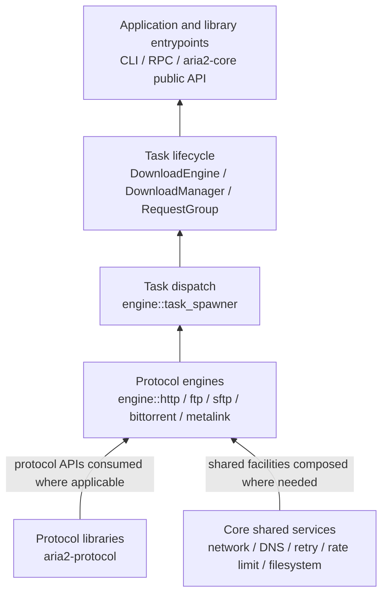

# Protocol Architecture

This document records where each protocol is implemented and how a download
travels from CLI/RPC input to network I/O. The structure follows ownership:
wire formats and reusable protocol clients live in `aria2-protocol`; task
policy and command execution live in `aria2-core`; CLI, RPC, and configuration
translation live in `aria2`.

## Layers, bottom to top



The diagram reads from foundation to application. Runtime calls go the other
way: CLI/RPC or a library caller adds a task; task lifecycle code reaches
`task_spawner::create_command_for_uri`; that one function selects a protocol
command. The selected command owns transfer execution and cleanup. Shared
services are passed where a protocol uses them; they are not a mandatory chain
through every protocol.

`aria2-protocol::http::HttpClient` and the standalone FTP client are public
protocol-library interfaces. The HTTP download engine uses its own reqwest
pool, network binding, redirect, cookie, retry, and task policies, so the
standalone HTTP client is not inserted as a redundant adapter in that route.

## Runtime request path

```text
CLI / RPC / library API
  → DownloadManager / DownloadEngine / RequestGroupMan
  → engine::task_spawner::create_command_for_uri
  → protocol command
  → protocol-specific network and transfer path
  → request/piece completion, persistence, and task result
```

The dispatcher also detects Metalink input before normal URI dispatch. Metalink
expands metadata into payload request groups; each payload then follows the
underlying supported URI route, such as HTTP, FTP, SFTP, or BitTorrent. For
HTTP, dispatch hands construction to `engine::http::command_factory`, which
resolves the target and proxy addresses before building the HTTP command.

## Protocol routes

| Input | Core command path | Protocol implementation | Result path |
|---|---|---|---|
| HTTP/HTTPS | `task_spawner` → `engine::http::command_factory` → `download_command`; range probing and concurrent requests use `segment_downloader`, while transfers use `concurrent_download` → `request_executor` or `sequential_download`. | `aria2-core::http` owns request policy, cookie storage, response processing, TLS identity, and reusable client pools. `engine::http::client_config` composes download options, DNS answers, proxy settings, and outbound-address policy into reqwest clients. The standalone `aria2-protocol::http::HttpClient` remains a separate public client. | Shared request progress, retry/rate limiting, mirror/segment coordination, and `DiskWriter` |
| FTP/FTPS | `engine::ftp::download_command` → control/connection setup → transfer or proxy transfer. | `aria2-core::ftp` owns engine negotiation and proxy/pool policy; `aria2-protocol::ftp` supplies reusable FTP APIs and TLS streams. | Shared request progress and `DiskWriter` |
| SFTP | `engine::sftp::download_command` → `aria2-protocol::sftp` connection/session/file operations. | `aria2-protocol::sftp` owns SSH/SFTP connection, packet, session, and file-operation details. | Shared request progress and `DiskWriter` |
| BitTorrent | `engine::bittorrent::download::command` → `download::execute`; magnet entry at `magnet::download_command`. | `aria2-protocol::bittorrent` owns Bencode, torrent parsing, wire messages, peer transport, DHT, tracker primitives, and extensions. Core owns download policy, peer/piece state, tracker orchestration, task lifecycle, and the process-level DHT-family registry. | Piece verification and filesystem writers; peer, tracker, and DHT state stay within the BitTorrent module |
| Metalink | `aria2-protocol::metalink` parser → `engine::metalink::to_request_group` → `engine::metalink::download_command`. | The core command expands selected mirrors, hashes, and MetaURLs into payload work. | Each payload enters its supported URI command path, including HTTP, FTP, SFTP, or BitTorrent; Metalink does not implement a second byte-transfer protocol |

### HTTP assembly and transfer path

1. `task_spawner::create_command_for_uri` selects HTTP/HTTPS and delegates
   command construction to `engine::http::command_factory`.
2. `command_factory` resolves the origin and proxy addresses when async DNS is
   enabled, then supplies those results and the outbound-address policy to
   `DownloadCommand`.
3. `download_command::constructor` calls `client_config` to build the primary
   reqwest client and range-client pool. It then owns the request, auth, cookie,
   progress, and output-path state for the task.
4. `download_command::execute` prepares metadata and, when needed, probes Range
   support through `HttpSegmentDownloader::probe_range_metadata`. The probe
   returns the effective URL, entity length, and negotiated HTTP version.
5. If concurrent ranges are allowed, `ConcurrentDownloader::execute_with_retry`
   selects its single-source scheduler or multi-mirror pipeline. Each path
   submits work through `request_executor`; that executor runs
   `HttpSegmentDownloader` requests and sends response chunks to the disk writer.
6. Otherwise, or after concurrent fallback, `SequentialDownloader` streams the
   response or fills only incomplete gaps. Both paths update progress and
   control-file state before `DownloadCommand::finalize_attempt` completes the
   task.

HTTP trackers and WebSeeds remain under BitTorrent because their retry,
announce, peer, and piece semantics are BitTorrent behavior. DHT wire and
lookup primitives live in `aria2-protocol::bittorrent`; torrent-scoped lookup
scheduling and process ownership live in `aria2-core::engine::bittorrent`.
Local Peer Discovery is implemented as a BitTorrent discovery module in core:
its BEP 14 framing, multicast socket, receive loop, and peer-registry updates
are currently coupled to torrent activity, so they stay together under
`engine::bittorrent::discovery::lpd` rather than adding an unused lower-layer
facade.

## Ownership rules

- `aria2-protocol/src/{http,ftp,sftp,bittorrent,metalink}` is the lower
  protocol-library layer. A protocol module owns its wire representation and
  reusable protocol-specific operations; it does not depend on `aria2-core`.
- `aria2-core/src/engine/{http,ftp,sftp,bittorrent,metalink}` owns protocol
  commands and behavior that depends on request groups, storage, retries,
  scheduling, or process-wide state. Protocol-specific code stays in its
  protocol directory.
- `aria2-core/src/engine` keeps cross-protocol work: task lifecycle, dispatch,
  shared mirror/segment coordination, checkpoints, and engine services. The
  HTTP-only cookie helper, concurrent downloader, range-probe path, and
  sequential downloader live under `engine/http`; protocol-specific work does
  not remain at engine root just because it is shared by HTTP transfer
  strategies. HTTP target/proxy DNS resolution is owned by
  `engine/http/command_factory`, and reqwest client construction is owned by
  `engine/http/client_config`.
- `aria2-core/src/{http,ftp,network}` owns shared core policy and helpers used
  by the engine. These directories are distinct from the similarly named
  engine directories: the former implement reusable policy; the latter
  assemble that policy into a download command.
- `aria2-core` crate-root exports remain the supported application library
  surface. The engine directory layout is an implementation seam; applications
  should use the task-facing types re-exported from `aria2_core`.

The standalone `aria2-protocol::http::HttpClient` and FTP client APIs have their
own public library callers and tests. The core also exposes
`aria2-core::http::connection` as a public connection-management interface.
These APIs remain independent; the active download engine directly composes
reqwest with pooling, address binding, request policy, and task lifecycle. Do
not add a pass-through engine client around either public interface.

## Module audit

- **Keep** the protocol-library folders and their codecs, clients, parsers,
  and transport-specific state. They provide independently usable protocol
  behavior.
- **Keep** shared engine modules at `engine` level when they own cross-protocol
  lifecycle or a reusable coordination interface, including `task_spawner`,
  `concurrent_segment_manager`, and `mirror_coordinator`.
- **Narrow** the former flat collection of `bt_*`, `http_*`, FTP, SFTP, and
  Metalink engine modules into the protocol directories above. This is a source
  organization and module-path change; it does not alter download semantics,
  wire behavior, or task-facing crate-root exports. Previously public HTTP
  engine module paths remain as re-exports while their implementations live
  under `engine/http`.
- **Keep** the scheme dispatch in `task_spawner`; protocol commands own the
  execution after construction. Separate selectors or forwarding command
  wrappers would repeat that seam without adding behavior.
- **Narrow** HTTP construction to its protocol directory: the HTTP factory now
  owns target/proxy DNS resolution, and `client_config` owns reqwest setup.
  Generic task dispatch no longer assembles HTTP-specific addresses or client
  options.
- **Narrow** range probing to `HttpSegmentDownloader::probe_range_metadata`.
  The former `RangeProber` only forwarded configuration and the probe call, so
  its tests now exercise the downloader interface directly.
- The unregistered `peer_choke_command.rs` file had no `engine` module
  declaration, call sites, or reachable public API. It was removed as dead
  source; active choking state and execution remain with BitTorrent peer
  storage and its choke manager.
- **No public API deletion** is based only on the absence of an in-workspace
  caller. Published standalone protocol APIs and documented crate-root exports
  remain supported. The `engine` module layout is documented as an internal
  seam, so its protocol-specific paths can follow the ownership structure.
