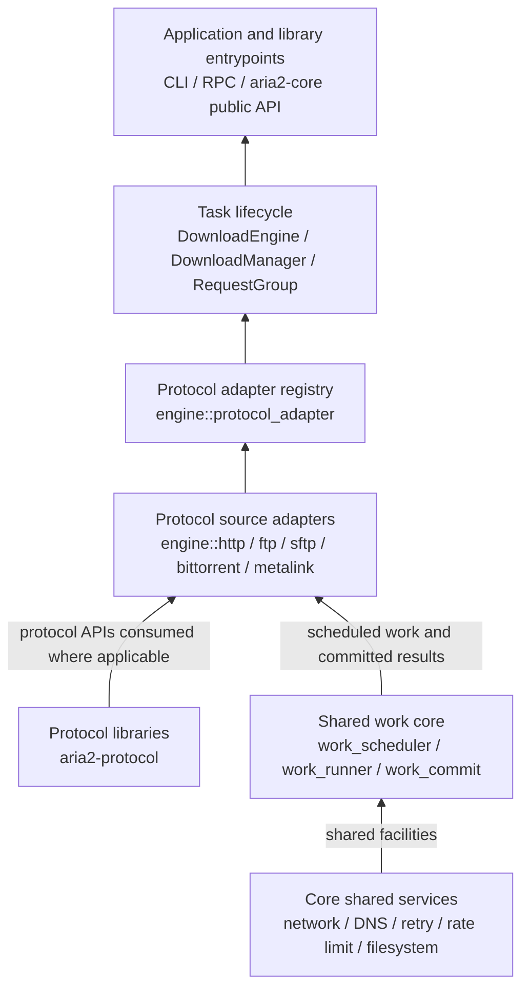

# Protocol Architecture

This document records where each protocol is implemented and how a download
travels from CLI/RPC input to network I/O. The structure follows ownership:
wire formats and reusable protocol clients live in `aria2-protocol`; task
policy and command execution live in `aria2-core`; CLI, RPC, and configuration
translation live in `aria2`.

## Layers, bottom to top



The diagram reads from foundation to application. Runtime calls go the other
way: CLI/RPC or a library caller adds a task; task lifecycle code starts a
tracked task, which asks `ProtocolAdapterRegistry` to select a registered
adapter. Each protocol adapter constructs its command and owns the protocol
setup it needs. The command supplies protocol-specific work items and request
rules to the shared work core. `WorkScheduler` owns generic queueing, bounded
admission, attempt counts, retry deadlines, and cancellation; `work_runner`
drives single-item attempts; `work_commit` enforces
validation-before-write-before-stable-persistence-before-checkpoint ordering
for complete work items. Adapters supply source requests, retry classification,
validation rules, and output/checkpoint handles. This keeps
transport and format policy with its source while the common work lifecycle is
independent of HTTP, FTP, SFTP, BitTorrent, or Metalink types.

The command registry and the work-item interface are separate seams. A new
protocol registers a command adapter and implements the shared work interfaces;
it does not add a branch to `task_spawner` or a protocol case to
`WorkScheduler`. HTTP/3 can use the same interfaces when its transport is added;
this change does not add an HTTP/3 network stack.

`aria2-protocol::http::HttpClient` and the standalone FTP client are public
protocol-library interfaces. The HTTP download engine uses its own reqwest
pool, network binding, redirect, cookie, retry, and task policies, so the
standalone HTTP client is not inserted as a redundant adapter in that route.

## Runtime request path

```text
CLI / RPC / library API
  → DownloadManager / DownloadEngine / RequestGroupMan
  → engine::task_spawner::spawn_download_task
  → engine::protocol_adapter::ProtocolAdapterRegistry
  → engine::<protocol>::command_adapter
  → protocol command
  → shared work scheduler / single-item runner
  → protocol source request and response
  → source validation → output write → stable-storage barrier → checkpoint
  → request/piece completion and task result
```

The Metalink adapter claims groups with Metalink source metadata before URI
dispatch. It expands metadata into payload request groups; each payload then
uses the adapter for its underlying route, such as HTTP, FTP, SFTP, or
BitTorrent. The built-in registry orders metadata and scheme-specific adapters
before the HTTP fallback. The HTTP adapter delegates construction to
`engine::http::command_factory`, which resolves target and proxy addresses.

## Shared work-item interface

`engine::work_scheduler::WorkScheduler<T>` is transport-neutral. A caller
queues typed payloads under opaque `WorkId`s, admits a bounded number of
leases, and reports completion, failure, or unstarted requeue. Retry budgets,
delayed work, cancellation, and active-lease validation live in that module.
`engine::work_runner::SingleWorkAdapter` uses the same scheduler for a single
logical item while allowing its adapter to classify source-specific errors and
wait interruptibly on task lifecycle changes.

`engine::work_commit::WorkCommitter` is for complete work items whose adapter
can define validation and persistence. Its order is received, validated,
written, durably persisted, then committed. `Committed` requires a successful
stable-storage barrier; a successful write into the operating-system page cache
alone is not persistence. Rust's `std::io::Write::flush` only drains writer
buffers. File-backed `DiskWriter::flush` explicitly follows it with
`File::sync_all` and a path namespace barrier; checkpoint paths use
`DiskWriter::sync_data` to sync payload contents and the initial output path
entry before advancing a sibling checkpoint. `SeekableDiskWriter::sync_all`
remains the barrier for positioned writes. On Unix the namespace barrier
synchronizes the containing directory chain after syncing the file. On Windows
it opens and flushes the containing directory handle; unsupported directory
barriers return an error. BitTorrent multi-file setup also syncs the parent
entry for each directory it creates, from the deepest new directory upward;
this avoids relying on write access to unrelated pre-existing ancestors.
Checkpoint replacement uses `MoveFileExW` with
`MOVEFILE_WRITE_THROUGH` as its rename barrier. Checkpoint files are advanced
only after payload synchronization succeeds. When a new checkpoint is based
on an existing resume prefix, the engine first syncs that existing payload
and its path entry. `File::sync_data` may skip nonessential file metadata and
some platforms implement it as `sync_all`.

Validation is source-defined. HTTP status, Content-Range, offset, and expected
body-length checks establish protocol correctness, but do not claim
cryptographic integrity unless an explicit digest is available and verified.
BitTorrent complete pieces are committed only after their v1/v2 piece hash is
verified and payload data is durably synced. Received BitTorrent blocks are
staged and may be structurally checked, but are not called committed pieces.
HTTP range chunks are likewise intermediate writes; a range lease completes
only after its output has crossed the stable-storage barrier. Streaming
protocols use `SequentialWorkCommitter` and sync before advancing a resumable
checkpoint. These paths keep network and protocol decisions outside the
generic scheduler.

Scheduler transition tests use the synchronous `WorkScheduler<T>` directly,
injecting `Instant` values for retry deadlines. They require no network,
filesystem, Tokio runtime, or wall-clock sleeps. Fake commit adapters separately
verify that persistence failure cannot advance a checkpoint or report a commit.

HTTP range/mirror coordination and BitTorrent peer/piece selection retain
their domain policies. They choose which work items to offer and what source
rules apply; the shared scheduler owns lease lifecycle, attempt budgets, and
retry admission.

## Protocol routes

| Input | Core command path | Protocol implementation | Result path |
|---|---|---|---|
| HTTP/HTTPS | `ProtocolAdapterRegistry` → `engine::http::command_adapter` → `command_factory` → `download_command`; range probing and concurrent requests use `segment_downloader`, `concurrent_download`, and `request_executor`; sequential bodies use `sequential_download`. | `aria2-core::http` owns HTTP request/response policy, cookies, TLS identity, and client pools. `engine::http::client_config` composes options, DNS answers, proxy settings, and outbound-address policy into reqwest clients. The standalone `aria2-protocol::http::HttpClient` remains a separate public client. | Range leases use `WorkScheduler`; chunks are intermediate writes, and completed ranges cross `sync_all` before scheduler completion. Sequential response checks establish HTTP protocol validity, not cryptographic integrity; file finalization and checkpoints use stable-storage barriers. HTTP mirror/range policy remains in the HTTP adapter. |
| FTP/FTPS | `ProtocolAdapterRegistry` → `engine::ftp::command_adapter` → `FtpDownloadCommand` → proxy GET or FTP control/data transfer. | The adapter composes core DNS/address policy, proxy handling, FTP control flow, and lifecycle. `aria2-protocol::ftp::connection::control_io` shares injected control-stream reads/writes, `FtpActiveDataListener` shares active data acceptance, and `aria2-protocol::ftp::tls` supplies FTPS streams. Response and PASV/EPSV parsing policy stays with each source. | `SingleWorkAdapter` supplies attempts; `SequentialWorkCommitter` writes chunks and syncs payload before advancing a checkpoint. Whole-file checksum policy uses the shared checksum service. |
| SFTP | `ProtocolAdapterRegistry` → `engine::sftp::command_adapter` → `SftpDownloadCommand` → `OutboundNetworkPolicy` TCP stream → `SshConnection::connect_with_stream` → `SftpSession` → `SftpFileOps`. | `aria2-protocol::sftp` owns SSH handshake/authentication, SFTP framing and request IDs, packet codec, and file operations. The adapter supplies URI/auth resolution, address policy, retry classification, and remote read offsets. | `SingleWorkAdapter` supplies attempts; source chunks use `SequentialWorkCommitter` for local writing, progress, and checkpoints. Payload is synced before checkpoint advancement. Whole-file checksum policy uses the shared checksum service. |
| BitTorrent | `ProtocolAdapterRegistry` → `engine::bittorrent::command_adapter`; torrent payloads use `download::command` → `download::execute`, while magnet input resolves metadata before the payload command. | `aria2-protocol::bittorrent` owns Bencode, torrent/magnet parsing, wire messages, peer transport, DHT, tracker primitives, and extensions. The adapter owns peer discovery, availability, rarity/endgame selection, and per-piece hashes. | Core `WorkScheduler` leases piece and WebSeed work. Received blocks are staged after layout checks and can be checkpointed only after their payload is synced. Complete pieces pass v1/v2 hash validation, then stable-storage sync, then live completion/checkpoint publication through `WorkCommitter`; BT-specific peer feedback and piece accounting remain in the adapter. |
| Metalink | `ProtocolAdapterRegistry` → `engine::metalink::command_adapter` → `engine::metalink::download_command`; parsing uses `aria2-protocol::metalink` and expands through `engine::metalink::to_request_group`. | The adapter expands mirrors, hashes, and MetaURLs into payload tasks; metadata and payload retries use the shared single-item runner. | Payload chunks pass through `SequentialWorkCommitter`, then each payload enters its supported URI source adapter, including HTTP, FTP, SFTP, or BitTorrent; Metalink does not implement a second byte-transfer protocol. |

### HTTP assembly and transfer path

1. `ProtocolAdapterRegistry` selects the HTTP adapter, which delegates
   command construction to `engine::http::command_factory`.
2. `command_factory` resolves the origin and proxy addresses when async DNS is
   enabled, then supplies those results and the outbound-address policy to
   `DownloadCommand`.
3. `download_command::constructor` calls `client_config` to build the primary
   reqwest client and range-client pool. It then owns the request, auth, cookie,
   progress, and output-path state for the task.
4. `download_command::execute` prepares metadata and, when needed, probes Range
   support through `HttpSegmentDownloader::probe_range_metadata`. The probe
   returns the effective URL, entity length, and negotiated HTTP version.
5. If concurrent ranges are allowed, `ConcurrentDownloader::execute_with_retry`
   selects its single-source scheduler or multi-mirror pipeline. Each path
   submits generic leases through `WorkScheduler`; `request_executor` runs
   `HttpSegmentDownloader` requests and sends offset-bearing response chunks
   to the HTTP output adapter. A range lease is completed only after `sync_all`
   succeeds; requested checkpoint saves use the same payload barrier.
6. Otherwise, or after concurrent fallback, `SequentialDownloader` streams the
   response after HTTP status and body checks. These checks are protocol
   validation, not cryptographic integrity validation. The output sink writes
   chunks and syncs before advancing control-file checkpoints; finalization
   establishes stable storage before task completion. Gap filling retains its
   range-specific planning and fallback behavior. `DownloadCommand` then
   finalizes the request group.

### FTP/FTPS assembly and transfer path

1. `ProtocolAdapterRegistry` selects `engine::ftp::command_adapter`, which
   creates `FtpDownloadCommand`. Its constructor parses the FTP URI and maps
   request options into task state.
2. `FtpDownloadCommand::execute` owns the request lifecycle, retry policy,
   address refresh, cancellation, and checkpoint cleanup. Each attempt enters
   `execute_single_attempt`.
3. An HTTP proxy configured for FTP can take the direct proxy-GET path. Other
   proxy requests establish an HTTP CONNECT tunnel; direct requests resolve
   origin addresses and connect through `OutboundNetworkPolicy`. Plain FTP,
   explicit FTPS, and implicit FTPS share `RawFtpControl`; both it and the
   standalone client pass their established control streams through
   `aria2-protocol::ftp::connection::control_io`. FTPS upgrades use
   `aria2-protocol::ftp::tls`.
4. The FTP control flow authenticates, selects TYPE, traverses the URI directory
   with PWD/CWD, and queries optional MDTM and SIZE metadata. Before RETR it
   reconciles the remote size with the local file, continuation state, and
   checkpoint; dry-run and already-complete targets can finish here.
5. The command negotiates EPSV/PASV or EPRT/PORT, applies REST when resuming,
   sends RETR, accepts/connects the data socket, and upgrades FTPS data TLS when
   configured. Active-mode listening/acceptance uses the shared
   `FtpActiveDataListener`; the core still controls bind address and advertised
   endpoint selection.
6. `receive_data_transfer` passes source chunks through the core
   `SequentialWorkCommitter`, which writes through `DiskWriter`, updates request
   progress, and syncs payload before advancing the existing checkpoint. The HTTP proxy GET route
   uses the same committer. The command retains rate-limit setup, transfer-length
   policy, checksum configuration, and FTP completion handling.

`aria2-protocol::ftp::connection::FtpConnection` plus
`aria2-protocol::ftp::download::FtpDownload` is a separate standalone client
API over direct plain-TCP connections. The engine does not call it because its
task route must compose core address binding, HTTP proxy modes, FTPS, and
`RequestGroup` lifecycle behavior. Both interfaces are kept at their own
boundaries; the standalone client is not an adapter around the engine command.

### SFTP assembly and transfer path

1. `ProtocolAdapterRegistry` selects `engine::sftp::command_adapter`, which
   creates `SftpDownloadCommand` and injects the process outbound-network
   policy and global rate limiter.
2. The command parses the SFTP URI, resolves credentials and output state, and
   builds SSH options including the configured host-key fingerprint policy.
3. The engine asks `OutboundNetworkPolicy` to create the target TCP stream and
   passes that stream to `SshConnection::connect_with_stream`. The protocol
   module owns the SSH handshake, host-key check, authentication, and
   subsystem channel. Its separate `SshConnection::connect` entry point is for
   standalone direct TCP use.
4. `SftpSession::open` sends INIT, negotiates the server version, and owns packet
   reads/writes, request IDs, serialized request/response exchanges, response-ID
   validation, operation counts, and timeouts. It reports typed
   `SftpSessionError` values for SSH, packet, channel, timeout, and correlation
   failures. `SftpFileOps` translates filesystem status packets into
   `FileOpError` and preserves session errors as sources; `SftpRemoteFile`
   provides positioned reads/writes and explicit handle closure with the same
   file-operation error type.
5. The engine stats and opens the remote file, reconciles the local length and
   checkpoint, then reads chunks at explicit offsets. It passes each chunk
   through the core `SequentialWorkCommitter` for local writing and progress;
   the payload is synced before checkpoint updates and final checksum
   verification/task completion.

`aria2-protocol::sftp::transfer::SftpTransfer` remains a public standalone
transfer interface. It adds local-file I/O, configurable buffering, resume,
progress callbacks, and optional source permission and timestamp preservation
over `SftpFileOps`.
It returns typed `TransferError` values with the original SFTP or local I/O
error preserved as a source. Resume inspection treats only an explicit
not-found response as unsupported; transport and permission failures propagate.
The engine does not call it because the engine path must write through its
`DiskWriter` and `RequestGroup` checkpoint lifecycle.

HTTP trackers, UDP trackers, WebSeeds, and DHT remain under BitTorrent because
their retry, announce, peer, lookup, and piece semantics are BitTorrent
behavior. UDP tracker framing and packet codecs live in
`aria2-protocol::bittorrent::tracker`; core resolves tracker addresses through
`OutboundNetworkPolicy`, binds the UDP socket, and owns transaction retries and
announce lifecycle. DHT wire and lookup primitives live in
`aria2-protocol::bittorrent`; torrent-scoped lookup scheduling and process
ownership live in `aria2-core::engine::bittorrent`.
HTTP tracker requests use reqwest: under the direct network policy there is no
local source address to select, so the request client owns DNS and proxy
routing. Host resolution is needed for source-family matching only when an
explicit outbound address/interface is configured; pre-resolving in direct
mode can reject an announce before the HTTP client starts it.
Local Peer Discovery is implemented as a BitTorrent discovery module in core:
its BEP 14 framing, multicast socket, receive loop, and peer-registry updates
are currently coupled to torrent activity, so they stay together under
`engine::bittorrent::discovery::lpd` rather than adding an unused lower-layer
facade.

### BitTorrent assembly and transfer path

1. `ProtocolAdapterRegistry` selects `engine::bittorrent::command_adapter` for
   existing torrent metadata, a `bt://` request, or a `magnet:` URI. It routes
   payloads to `BtDownloadCommand` and magnets to `MagnetDownloadCommand`.
2. The magnet command uses the protocol library's `MagnetLink` parser, then
   resolves metadata in this order: a saved torrent when enabled, an `xs`
   exact source, tracker-discovered peers, then DHT-discovered peers and BEP 9
   metadata exchange. `metadata_source` coordinates those sources;
   `discovery` owns tracker/DHT peer lookup; `metadata` owns saved files,
   BEP 9 normalization, WebSeed merging, and info-hash checks.
3. Before payload transfer, the command enforces the private-torrent DHT rule,
   optionally saves the complete torrent metadata, and completes immediately
   for metadata-only requests. Otherwise it constructs `BtDownloadCommand`
   with the existing `RequestGroup`, the resolved torrent bytes, and the
   outbound-network policy. Any DHT engines acquired for metadata discovery
   are handed to that command so the payload stage can reuse them.
   For payload downloads, the validated, normalized metainfo is also retained
   on that same group before handoff. Session snapshots encode it in the
   existing `aria2-rust-bt-metadata-data` field, allowing a restored magnet task
   to start directly from its metainfo without needing the original `xs`
   source or repeating BEP 9 discovery. Metadata-only requests complete before
   this payload-resume snapshot is installed.
4. `BtDownloadCommand::execute` prepares the torrent layout and integrity
   state, then coordinates tracker/DHT discovery, peer sessions, piece
   selection, and WebSeeds through `download::execute`. The piece source uses
   the core `WorkScheduler` for work leases. Received blocks are staged after
   layout checks; their in-flight checkpoint bits are published only after
   payload sync. Complete pieces pass their v1/v2 hash validator, are written
   and synced, then become live-complete and eligible for checkpoint publication
   through `WorkCommitter`.
   Peer messages and transport use `aria2-protocol::bittorrent`; peer selection
   and bad-peer feedback remain BitTorrent-specific policy.
5. Peer interaction selects uTP, MSE, or a plain TCP fallback from task
   settings. Core establishes the policy-approved TCP stream and passes it to
   the protocol handshake. Plain and MSE handshakes both return the same
   `PeerConnection`; it owns message framing and applies MSE encryption when
   negotiated. `BtPeerConn` then adds engine peer state and statistics. Once
   initialized, it is moved into a long-lived `PeerActor`; that actor is the
   sole runtime owner of the connection and performs its socket reads/writes.
   Coordinators send peer commands and consume peer events rather than doing
   parallel socket I/O. `BtPeerConn` therefore remains the actor-owned
   connection/state object at runtime; only pre-actor ownership is temporary.
   The torrent-scoped `TorrentSession` owns the `PeerSwarm`, which the
   piece-download coordinator borrows and then transfers into seeding. Magnet
   metadata actors are activated for payload in place, preserving the same
   connections and registry across that transition.
6. `TrackerAnnouncer` selects one tracker URL from `BtAnnounce`, resolves UDP
   tracker addresses through the outbound policy, and calls the core UDP
   client. The retained `AnnounceList` manages multi-tier URL order and failure
   rotation; the UDP client sends CONNECT then ANNOUNCE/SCRAPE using the
   protocol crate's packet codecs. Only the redundant UDP-specific manager and
   duplicate synchronous protocol client were removed.
   If a bencoded HTTP tracker response includes an `announce-list` field, the
   client treats it as an additional tracker extension and appends unseen
   tiers without replacing configured primary tiers; the actor's separate
   public-tracker fan-out remains independent. A later primary failure can
   select the added tiers. This is a Rust extension: upstream aria2's
   response handler does not consume that field, and BEP 15's fixed binary UDP
   announce response has no URL-list field.

### DHT inbound query path

The DHT engine is assembled from the UDP socket, routing table, KRPC services,
and bounded lookup scheduler. `engine/startup.rs::DhtEngine::start` loads the
family-specific state, binds the socket, builds the shared engine context, then
starts the inbound loop in `engine/receive.rs` and maintenance loops in
`engine_inner.rs`. `engine/api.rs` exposes peer lookup, announce, and BEP 44/51
operations; `engine/lifecycle.rs` owns bootstrap state, shutdown, and statistics.
`RoutingTable` owns node admission and health queries; `Bucket` owns node
membership and replacement candidates; `DhtNode` records responsiveness; the
private `bucket_tree` module owns bucket splitting and tree traversal.

`DhtEngineContext` stores one `DhtTaskContext` for the effective local node ID,
routing table, UDP socket, transaction tracker, and query timeout used at
runtime. Startup copies the configured timeout into that context. `DhtEngineInner`
stores only mutable lifecycle state, so direct engine calls, background loops,
and scheduled tasks share the same protocol resources.

1. `DhtSocket` is the sole UDP reader. `engine/receive.rs` distributes datagrams
   round-robin through bounded worker queues, skips full or closed workers, and
   drops a packet only when no queue accepts it. The KRPC decoder accepts only
   exact `y` values (`q`, `r`, or `e`), requires response dictionaries to carry
   a 20-byte node ID, and validates the two-field error shape. Invalid messages
   are dropped before they reach shared state. Responses and errors go to the
   transaction tracker. Unknown transactions and replies from the wrong source
   are ignored; a valid KRPC error closes its matched waiter as a failure so the
   querying task updates node health through the same path as a timeout.
   Queries enter `DhtQueryHandler`. Shutdown closes queue senders, drains
   pending packets for up to 100 ms, then aborts workers that are still blocked.
2. The handler validates the query method and sender node ID, ignores packets
   from the local node, then dispatches `ping`, `find_node`, `get_peers`, and
   `announce_peer` to the BEP 5 handlers. `items` owns BEP 44 `get`/`put`, and
   `sample` owns BEP 51 `sample_infohashes`; sampling depends on peer storage,
   not on the optional BEP 44 item store.
3. `HandleResult` carries the response and an optional sender ID eligible for
   promotion. The engine releases the routing-table and token locks, sends the
   response, then promotes an accepted sender into the routing table.

### DHT background maintenance path

1. `engine_inner.rs::spawn_periodic_tasks` owns the maintenance timers and
   submits work to the bounded `DhtTaskQueue`; it does not perform network or
   persistence work in the timer loop. Token rotation is the synchronous
   exception and updates the token tracker directly.
2. Bucket refresh runs in periodic lane 1 through `BucketRefreshTask`.
   Node contact and cleanup run in periodic lane 2 through `MaintenanceTask`:
   contact selects one good node per bucket and issues bounded `PingTask`s;
   cleanup expires peer and transaction state, then evicts bad nodes and
   attempts cached replacements. These network-maintenance ticks are skipped
   while lane 2 is busy, preventing overlapping stale work.
3. Routing-table saves use the same lane but are queued even when it is busy.
   `MaintenanceTask` is the adapter required by the shared `DhtTask` queue;
   its variants each perform a distinct engine operation. The public
   `save_state` and `evict_nodes` methods call those same operations directly
   for on-demand requests.

### DHT persistence path

1. `engine/startup.rs::DhtEngine::start` reads the configured family-specific
   snapshot, accepts it only within `persistence_max_age`, and inserts restored
   nodes as unverified routing candidates.
2. Periodic saves, `save_state`, and shutdown all call
   `DhtEngineContext::save_state`. Shutdown first stops queued and background
   work, then reuses this method. It collects current good nodes;
   `DhtPersistence` serializes that single snapshot and atomically replaces the
   file under its cross-process file lock. Expired or evicted nodes are not
   merged back from an older snapshot.
3. The BEP 44 item store uses its own `.items` file. Both file writes run
   outside the async runtime and are attempted independently; one write failure
   does not suppress the other, and the shared method reports either or both
   errors.

Magnet is a metadata-resolution stage, not a second payload downloader. Both
magnet and `.torrent` inputs converge on the same `BtDownloadCommand` and piece
execution path. The command's implementation is split by its actual internal
roles under `magnet/download_command/`; those modules are private and do not
add another task-facing interface.

## Ownership rules

- `aria2-protocol/src/{http,ftp,sftp,bittorrent,metalink}` is the lower
  protocol-library layer. A protocol module owns its wire representation and
  reusable protocol-specific operations; it does not depend on `aria2-core`.
- `aria2-core/src/engine/{http,ftp,sftp,bittorrent,metalink}` owns protocol
  commands and behavior that depends on request groups, storage, retries,
  scheduling, or process-wide state. Protocol-specific code stays in its
  protocol directory.
- `aria2-core/src/engine` keeps cross-protocol work: task lifecycle, dispatch,
  work scheduling/running/commit, checkpoints, and engine services. HTTP
  range/mirror planners remain HTTP domain policy even though their existing
  public modules are rooted under `engine`. The HTTP-only cookie helper,
  concurrent downloader, range-probe path, and sequential downloader live under
  `engine/http`; protocol-specific work does not remain at engine root just
  because it is shared by HTTP transfer strategies. HTTP target/proxy DNS resolution is owned by
  `engine/http/command_factory`, and reqwest client construction is owned by
  `engine/http/client_config`.
- `aria2-core/src/{http,ftp,network}` owns shared core policy and helpers used
  by the engine. These directories are distinct from the similarly named
  engine directories: the former implement reusable policy; the latter
  assemble that policy into a download command.
- `aria2-core` crate-root exports remain the supported application library
  surface. The engine directory layout is an implementation seam; applications
  should use the task-facing types re-exported from `aria2_core`.

The standalone `aria2-protocol::http::HttpClient` and FTP client APIs have their
own public library interfaces and direct tests. The active FTP task route uses
the task command described above; the protocol crate's standalone
`FtpConnection`/`FtpDownload` remains a distinct external client API. The core
also exposes `aria2-core::http::connection`, `aria2-core::ftp::connection`, and
`aria2-core::ftp::connection_pool` as public library interfaces. These APIs
remain at their existing boundaries: the HTTP task path composes reqwest with
pooling, address binding, request policy, and task lifecycle, while the FTP
task path composes its control/data flow with core policy and FTPS primitives.
Do not add pass-through engine clients around these public interfaces.

## Module audit

- **Keep** the protocol-library folders and their codecs, clients, parsers,
  and transport-specific state. They provide independently usable protocol
  behavior.
- **Keep** shared engine modules at `engine` level when they own cross-protocol
  lifecycle or a reusable coordination interface, including `task_spawner`,
  `protocol_adapter`, `concurrent_segment_manager`, and `mirror_coordinator`.
- **Narrow** the former flat collection of `bt_*`, `http_*`, FTP, SFTP, and
  Metalink engine modules into the protocol directories above. This is a source
  organization and module-path change; it does not alter download semantics,
  wire behavior, or task-facing crate-root exports. HTTP engine modules now
  have one canonical path under `engine/http` without legacy path re-exports.
- **Narrow** `task_spawner` to tracked task creation and lifecycle cleanup.
  `ProtocolAdapterRegistry` selects the first supporting adapter; each protocol
  directory owns its command construction and dependency setup. HTTP is the
  final fallback, after metadata and scheme-specific adapters.
- **Narrow** HTTP construction to its protocol directory: the HTTP factory now
  owns target/proxy DNS resolution, and `client_config` owns reqwest setup.
  Generic task dispatch no longer assembles HTTP-specific addresses or client
  options.
- **Narrow** range probing to `HttpSegmentDownloader::probe_range_metadata`.
  The former `RangeProber` only forwarded configuration and the probe call, so
  its tests now exercise the downloader interface directly.
- **Narrow** FTP download source layout: public options/results are grouped in
  `aria2-protocol/src/ftp/download/types.rs`, transfer behavior stays in
  `download.rs`, and its direct tests live beside them. The module exports its
  canonical public types at the owning module boundary.
- **Narrow** FTP engine parser access: `download_command` imports the core FTP
  parsers directly instead of re-exporting them through its control module.
  Remove the unused private FTP error classifier; live response handling stays
  in the control commands and attempt retry path.
- **Narrow** FTP duplication by sharing injected control-stream line I/O and
  active data listener acceptance between the standalone protocol client and
  task engine. Keep each caller's response and PASV/EPSV parsing policy local;
  the core retains address binding, proxy selection, FTPS setup, and task
  lifecycle. The standalone client remains a distinct public client rather
  than a forwarding stage in the engine route.
- **Narrow** SFTP source layout into connection options/lifecycle,
  packet constants/types/attributes/codec/wire helpers, session request
  tracking, file-operation values, and separate standalone download/upload
  implementations. Each module exports its canonical public types at the
  owning module boundary. Keep the standalone `SftpTransfer` interface
  separate from the engine's request-group and `DiskWriter` lifecycle.
- **Delete** the unused SFTP SSH connection pool. It had no production callers,
  keyed connections without authentication or host-key policy, treated
  connection age as idle time, and could only drop pool references when asked
  to close. Callers can reuse an `SshConnection` directly when they need
  multiple SFTP channels.
- **Narrow** SFTP error handling by layer: the session returns typed
  `SftpSessionError` values for SSH, packet codec, channel I/O, timeout, and
  protocol negotiation or response correlation; file operations add their
  operation context and map server status codes into `FileOpError`. One
  serialized request path assigns and validates IDs, so the unused pending-map
  tracker and unpaired public send/receive methods are removed. Each completed
  exchange is counted once. The standalone transfer returns typed errors with
  low-level sources intact; the engine maps session and file-operation failures
  into task errors.
- **Narrow** Metalink expansion to one parse and selection pass that produces
  direct-resource groups and, when enabled, torrent metadata graphs from the
  same normalized entries and GID sequence. Remove the unused mirror types and
  forwarding entry points; `MetalinkFile` remains the parsed protocol model,
  while the core owns task expansion and lifecycle.
- **Narrow** the BitTorrent peer-connection seam: protocol owns plain/MSE
  handshakes, encryption, and one TCP message connection; core supplies the
  selected stream and assembles `BtPeerConn`. Incoming route selection also
  returns that same TCP connection type. Magnet metadata exchange uses parsed
  BitTorrent messages instead of a second raw-frame reader. The core uTP
  adapter remains because it owns the handshake and message framing over the
  stateful uTP socket. Require explicit outbound network policy for peer and
  UDP tracker entry points; remove direct-connect shortcuts, duplicate
  encrypted connection forwarding, and redundant incoming constructors. Core
  retains torrent-specific peer state at the engine seam.
- **Narrow** UDP tracker ownership: protocol contains only BEP 15 packet
  encoding and decoding; core owns policy-based DNS and binding, one-shot
  announce/scrape exchanges, transaction state, and timeout/retry handling.
  `AnnounceList` keeps URL order, tiers, and failure rotation; the UDP client
  receives only the currently selected URL. Keep this multi-tier tracker
  manager; remove only the duplicate synchronous client and UDP-specific
  execution manager. Resolve the selected URL once and reuse its address; DNS
  failures stay inside the outbound-policy boundary.
- **Narrow** DHT peer task composition: one `PeerLookupTask` performs the
  iterative `get_peers` traversal and can announce with tokens from that same
  traversal. Remove the duplicate `PeerAnnounceTask`; both peer discovery and
  explicit `announce_peer` use the same task path.
- Remove `DhtTaskFactory`, which only forwarded the shared context to task
  constructors. The engine now constructs the scheduled task directly, making
  task selection and its inputs visible at the scheduling point.
- Remove `NodeLookupTask`: it duplicated the public result-returning
  `lookup::iterative_find_node`, discarded its `NodeLookupResult`, and had no
  production callers. `BucketRefreshTask` keeps bounded fan-out while selecting
  stale bucket targets; callers that need one lookup can call the lookup API.
- Split DHT iterative queries by responsibility (`find_node`, `get_peers`,
  BEP 44 items, BEP 51 sampling, and announce) while keeping candidate
  ordering and query batching in the shared lookup module. Keep transaction
  matching in one RAII response-wait path; remove unused per-transaction
  `info_hash` and token storage.
- Encode outbound KRPC messages directly to bytes: the bencode writer is
  infallible, so `DhtMessage::encode` returns its buffer without a redundant
  `Result` layer. Keep parsing errors at the `decode` boundary and pass
  announce tokens as opaque bytes.
- **Narrow** the DHT UDP seam: keep the Tokio socket behind `DhtSocket` and
  route the engine receive loop through it instead of exposing the raw shared
  socket. The engine still handles timeout and shutdown selection around reads.
- **Narrow** DHT persistence to one current-good-node snapshot path. Keep the
  file lock and atomic replacement, remove the unused read/merge/write path
  that could restore evicted nodes, and collect good nodes at the routing-table
  boundary. The binary serializer is infallible; parse errors and filesystem
  failures remain at their respective decode and I/O boundaries.
- Split inbound DHT query handling by protocol responsibility: shared sender
  validation and dispatch stay in `DhtQueryHandler`; BEP 44 item operations and
  BEP 51 sampling live in focused submodules. Keep one handler entry point with
  an optional item store, and remove its former no-store forwarding overload.
- The unregistered `peer_choke_command.rs` file had no `engine` module
  declaration, call sites, or reachable public API. It was removed as dead
  source; active choking state and execution remain with BitTorrent peer
  storage and its choke manager.
- Retain public interfaces when they provide a documented standalone protocol
  capability or a useful ownership boundary. Remove aliases and forwarding
  variants that duplicate the canonical entry point. The `engine` module
  layout follows internal ownership.
- **Narrow** `DownloadManager` source organization into its submission/query facade,
  per-download handle, and engine-lifecycle handle. Keep the crate-root
  re-exports and observable behavior unchanged; organize its interface tests by
  waiting, lifecycle, queries, and submissions.
- **Keep** the BitTorrent process listener as the shared TCP/uTP info-hash
  router. Its clones share one listener lifecycle, which is cancelled only when
  the final manager owner is dropped; route handles still independently remove
  their torrent registration. Each accept/dispatch loop owns and drains its
  per-connection handshake tasks on shutdown; a peer-admission guard returns
  storage ownership if bounded route delivery is cancelled. Keep its loopback
  lifecycle tests in the adjacent `peer/listener/tests.rs` file.
